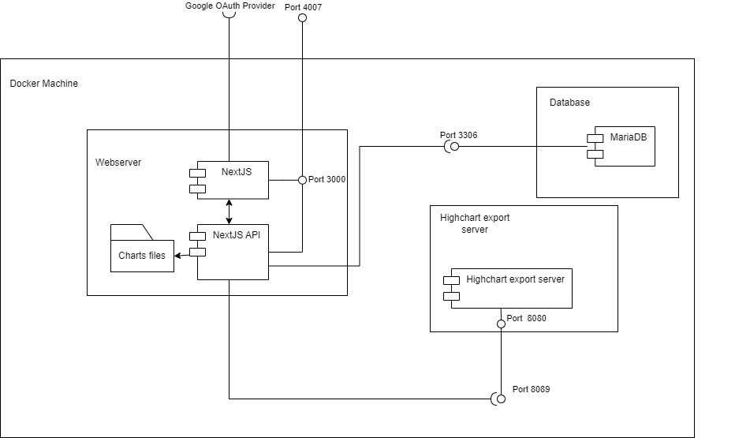
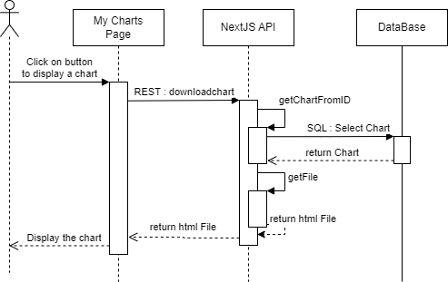
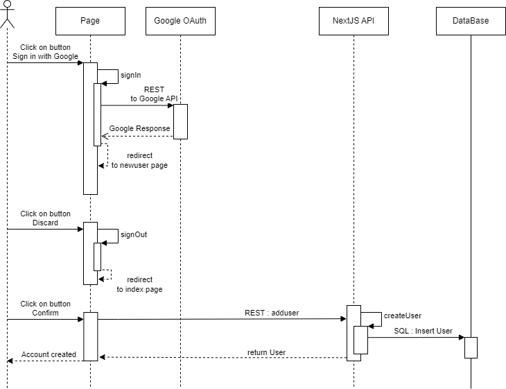
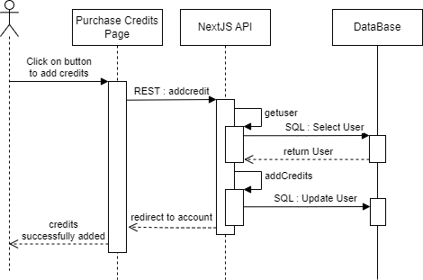

# Mychart
Student: Quentin BARON (ERASMUS)

## Installation
You can use the script [docker-compose.yaml](./docker-compose.yaml), it will create the stack with the last image build from repository. Or you can build the image from [Dockerfile](./Dockerfile).
You need to specify the environnement variable inside [docker-compose.yaml](./docker-compose.yaml) such as GOOGLE_ID, GOOGLE_SECRET and NEXTAUTH_SECRET.

## Demo
This project is accessible on [dev.qyubee.fr](https://dev.qyubee.fr). This is a private server where I excecute this project.

## Stress Test

I don't think I have enough time to do it. I may be very late because I don't know when to return the project.

## ULM
As my free trial of Visual Paradigm run out, I could use it for my diagram. I hope theses schemes will be fine for you. 
### Class Diagram

### Deployement Diagram

### Component Diagram

### Sequence Diagram : MyCharts

### Sequence Diagram : Create User

### Sequence Diagram : Create Chart

### Sequence Diagram : Purchase Credits
